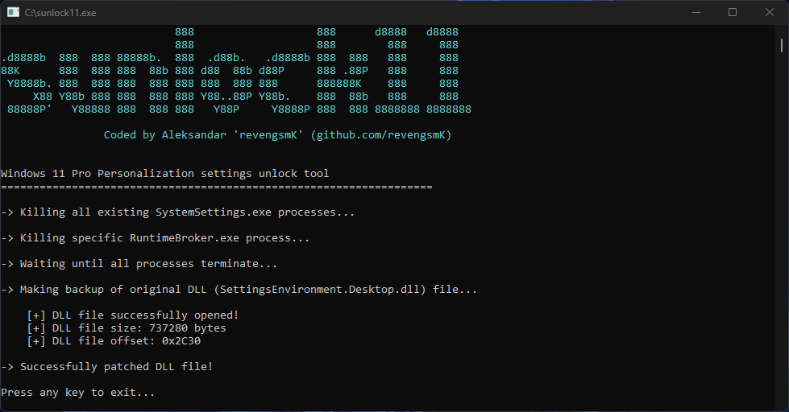

## sunlock11

Windows 11 Pro 22H2 Personalization settings unlock tool.

### Screenshot & demo

 


https://user-images.githubusercontent.com/95986479/222289754-92dd38d2-aee6-4470-b602-ee885b98724c.mp4


### Overview

One of the limitations of unactivated Windows 11 (besides watermark in the lower right corner of the screen) is locked personalization settings inside Settings app. This tool allows you to fully unlock these settings without the need to activate Windows OS.

It works by patching simple function inside Settings app DLL (SettingsEnvironment.Desktop.dll), that checks if Windows is activated or not.

### Usage

First, before using setpm.bat script, you may wish to backup original *SettingsEnvironment.Desktop.dll* file permissions. You can do this using **icacls.exe** */save* option. To restore original owner and saved permissions, use the **icacls.exe** */setowner* and */restore* options.

Run the **setpm.bat** script to set the required permissions (or set them manually). This is needed, because by default, only TrustedInstaller is allowed to modify files inside System32 folder.

After modifying file owner and permissions, run **sunlock11.exe**. **Both** the script and the unlock tool require administrative privileges, so make sure that you execute them as administrator.


### Tested versions

OS versions:

1. Windows 11 Pro 22H2 (OS Build 22621.1265)
2. Windows 11 Pro 22H2 (OS Build 22621.1344)
3. Windows 11 Pro 23H2 (OS Build 22631.3155)
4. Windows 11 Pro 23H2 (OS Build 22631.3447)
5. Windows 10 Pro 22h2 (OS Build 19045.2965)

DLL file versions:

1. SettingsEnvironment.Desktop.dll (10.0.22621.1194)
2. SettingsEnvironment.Desktop.dll (10.0.22621.1344)
3. SettingsEnvironment.Desktop.dll (10.0.22621.3155)
4. SettingsEnvironment.Desktop.dll (10.0.22621.3374)
5. SettingsEnvironment.Desktop.dll (10.0.19041.2913)


### Known issues

1. After next Windows update, SettingsEnvironment.Desktop.dll file often gets replaced with a new (unpatched) version, therefore locking/disabling personalization settings.


### Disclaimer

This program serves mainly as a reverse engineering demo, and you use it at your own risk. The author of this program cannot be held liable for any damages due to the use of this program. It is advisable not to use it on your main production PC, as it is modifying operating system file.

### Support

[](bitcoin:bc1qjwedefp3xruv7qak72l89hzx5mx0c0ftq8qem7)

If you would like to see more projects like this one, please consider supporting me :)  

Donate bitcoin to the following address:


```
bc1qjwedefp3xruv7qak72l89hzx5mx0c0ftq8qem7
```
